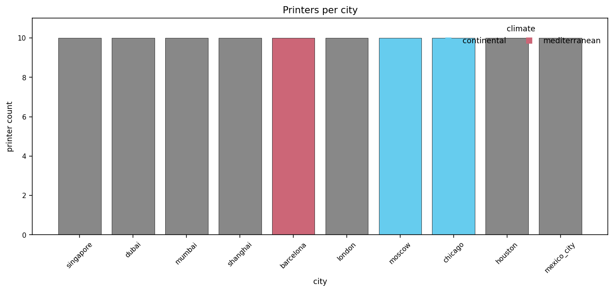
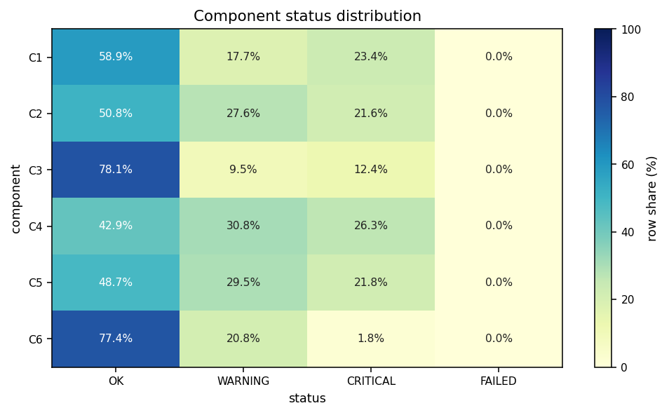
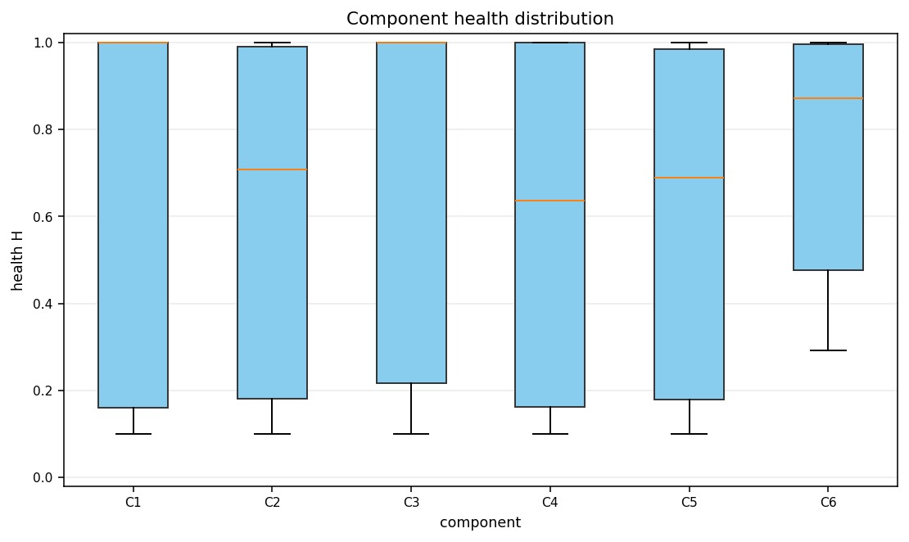
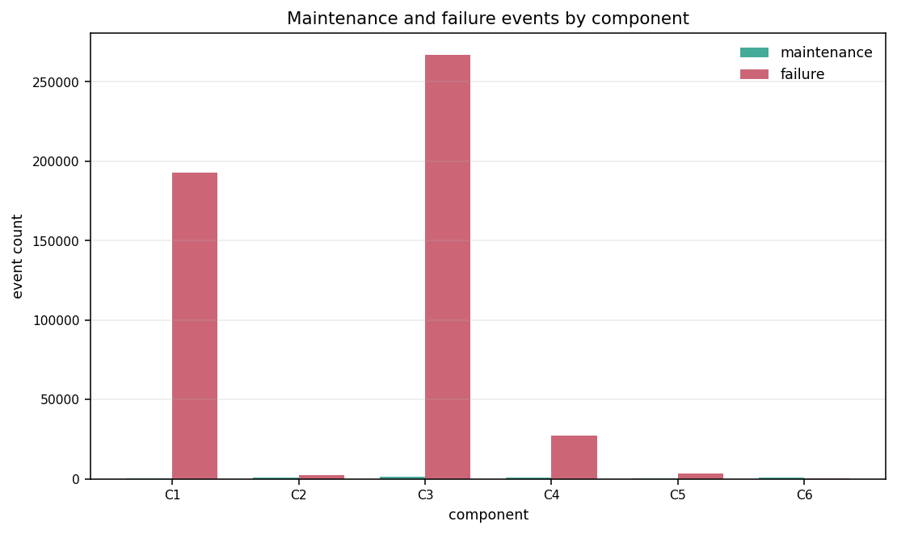
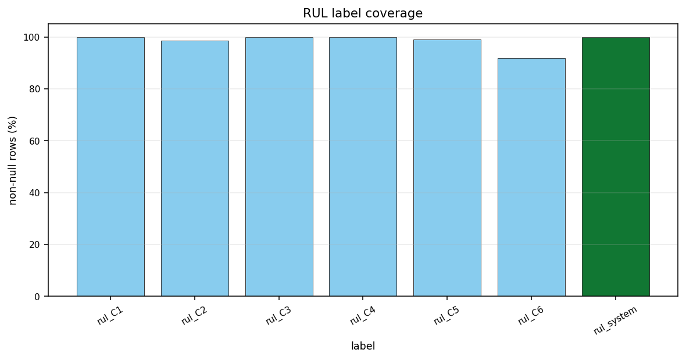
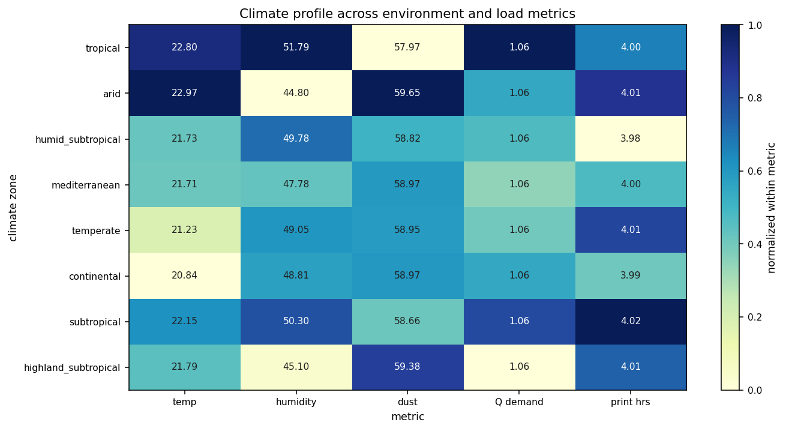
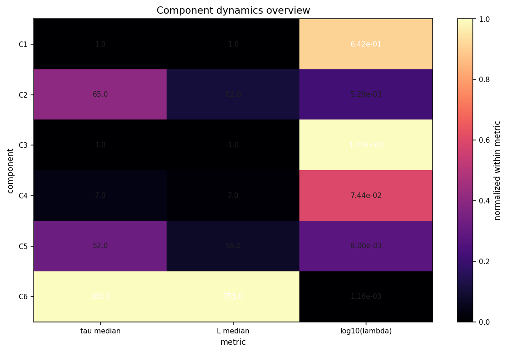
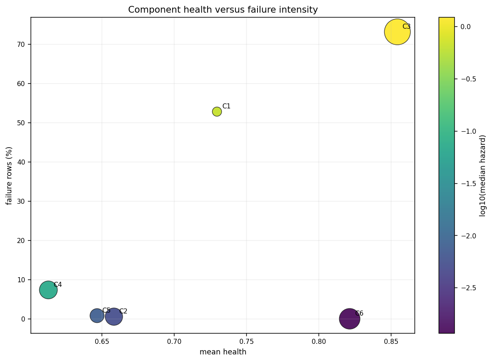
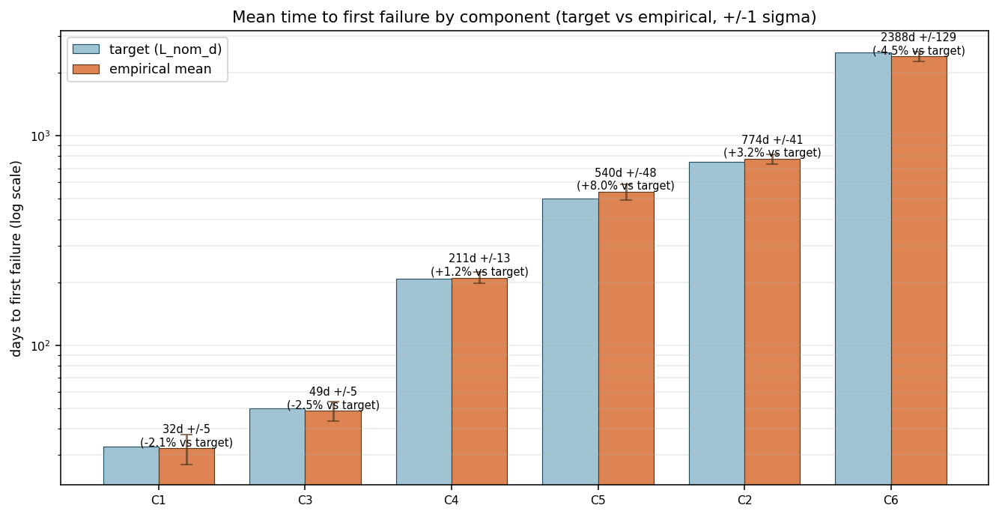

# Fleet Baseline EDA

Input: `data/fleet_baseline.parquet`.

This report profiles the deterministic SDG fleet baseline: one daily row per printer, city, and component state. The SDG generator seeds each printer by `printer_id`, assigns printers to 15 configured European cities, simulates weather and demand, evolves six component health channels `C1`-`C6`, emits maintenance and failure booleans, then derives RUL labels from future failure events.

A null RUL value means the row is right-censored for that label: no later failure for that component was observed inside the 2015-01-01 to 2024-12-31 dataset horizon.

## Dataset Shape

| metric               | value                       |
| -------------------- | --------------------------- |
| data_file            | data/fleet_baseline.parquet |
| file_size_mb         | 48.86                       |
| parquet_rows         | 365,300                     |
| parquet_columns      | 70                          |
| parquet_row_groups   | 1                           |
| dataframe_shape      | 365,300 x 70                |
| memory_mb_loaded     | 84.66                       |
| date_start           | 2016-01-01                  |
| date_end             | 2025-12-31                  |
| calendar_days        | 3,653                       |
| printers             | 100                         |
| cities               | 10                          |
| climate_zones        | 8                           |
| rows_per_printer_min | 3,653                       |
| rows_per_printer_max | 3,653                       |
| components           | C1, C2, C3, C4, C5, C6      |

## Column Groups

| group                 | columns                                                                                               |
| --------------------- | ----------------------------------------------------------------------------------------------------- |
| identity              | printer_id, city, climate_zone                                                                        |
| calendar              | date, day                                                                                             |
| weather_and_load      | ambient_temp_c, humidity_pct, dust_concentration, Q_demand, daily_print_hours, cumulative_print_hours |
| health                | H_C1, H_C2, H_C3, H_C4, H_C5, H_C6                                                                    |
| status                | status_C1, status_C2, status_C3, status_C4, status_C5, status_C6                                      |
| maintenance_clock     | tau_C1, tau_C2, tau_C3, tau_C4, tau_C5, tau_C6                                                        |
| age_since_replacement | L_C1, L_C2, L_C3, L_C4, L_C5, L_C6                                                                    |
| counters              | N_f, N_c, N_TC, N_on                                                                                  |
| hazard_rate           | lambda_C1, lambda_C2, lambda_C3, lambda_C4, lambda_C5, lambda_C6                                      |
| maintenance_events    | maint_C1, maint_C2, maint_C3, maint_C4, maint_C5, maint_C6                                            |
| failure_events        | failure_C1, failure_C2, failure_C3, failure_C4, failure_C5, failure_C6                                |
| rul_labels            | rul_C1, rul_C2, rul_C3, rul_C4, rul_C5, rul_C6, rul_system                                            |

## City and Climate Coverage

| city        | climate_zone         | printers | rows   | row_share_pct |
| ----------- | -------------------- | -------- | ------ | ------------- |
| singapore   | tropical             | 10       | 36,530 | 10.00%        |
| dubai       | arid                 | 10       | 36,530 | 10.00%        |
| mumbai      | tropical             | 10       | 36,530 | 10.00%        |
| shanghai    | humid_subtropical    | 10       | 36,530 | 10.00%        |
| barcelona   | mediterranean        | 10       | 36,530 | 10.00%        |
| london      | temperate            | 10       | 36,530 | 10.00%        |
| moscow      | continental          | 10       | 36,530 | 10.00%        |
| chicago     | continental          | 10       | 36,530 | 10.00%        |
| houston     | subtropical          | 10       | 36,530 | 10.00%        |
| mexico_city | highland_subtropical | 10       | 36,530 | 10.00%        |

| climate_zone         | cities | printers | rows   | row_share_pct |
| -------------------- | ------ | -------- | ------ | ------------- |
| tropical             | 2      | 20       | 73,060 | 20.00%        |
| arid                 | 1      | 10       | 36,530 | 10.00%        |
| humid_subtropical    | 1      | 10       | 36,530 | 10.00%        |
| mediterranean        | 1      | 10       | 36,530 | 10.00%        |
| temperate            | 1      | 10       | 36,530 | 10.00%        |
| continental          | 2      | 20       | 73,060 | 20.00%        |
| subtropical          | 1      | 10       | 36,530 | 10.00%        |
| highland_subtropical | 1      | 10       | 36,530 | 10.00%        |

## Weather and Demand by Climate

| climate_zone         | ambient_temp_c_mean | ambient_temp_c_p05 | ambient_temp_c_p95 | humidity_pct_mean | dust_concentration_mean | q_demand_mean | daily_print_hours_mean |
| -------------------- | ------------------- | ------------------ | ------------------ | ----------------- | ----------------------- | ------------- | ---------------------- |
| tropical             | 22.80               | 22.49              | 23.22              | 51.79             | 57.97                   | 1.063         | 4.003                  |
| arid                 | 22.97               | 21.89              | 23.94              | 44.80             | 59.65                   | 1.060         | 4.011                  |
| humid_subtropical    | 21.73               | 20.34              | 22.99              | 49.78             | 58.82                   | 1.059         | 3.977                  |
| mediterranean        | 21.71               | 20.99              | 22.50              | 47.78             | 58.97                   | 1.058         | 3.995                  |
| temperate            | 21.23               | 20.41              | 22.02              | 49.05             | 58.95                   | 1.058         | 4.009                  |
| continental          | 20.84               | 20.00              | 22.57              | 48.81             | 58.97                   | 1.060         | 3.993                  |
| subtropical          | 22.15               | 20.64              | 23.16              | 50.30             | 58.66                   | 1.061         | 4.015                  |
| highland_subtropical | 21.79               | 21.51              | 22.10              | 45.10             | 59.38                   | 1.055         | 4.005                  |

## Component Status Distribution

Statuses are written after the simulator applies preventive and corrective actions for the day. Because corrective failure handling resets the component before the row is emitted, `status_FAILED` can be zero even when `failure_*` event booleans are true.

| component | OK     | WARNING | CRITICAL | FAILED |
| --------- | ------ | ------- | -------- | ------ |
| C1        | 58.92% | 17.70%  | 23.38%   | 0.00%  |
| C2        | 50.80% | 27.58%  | 21.62%   | 0.00%  |
| C3        | 78.08% | 9.54%   | 12.38%   | 0.00%  |
| C4        | 42.91% | 30.76%  | 26.33%   | 0.00%  |
| C5        | 48.72% | 29.49%  | 21.80%   | 0.00%  |
| C6        | 77.38% | 20.81%  | 1.81%    | 0.00%  |

## Component Health

| component | min    | p01    | p05    | median | mean   | p95    | max    |
| --------- | ------ | ------ | ------ | ------ | ------ | ------ | ------ |
| C1        | 0.1000 | 0.1111 | 0.1600 | 1.0000 | 0.7296 | 1.0000 | 1.0000 |
| C2        | 0.1000 | 0.1170 | 0.1807 | 0.7076 | 0.6583 | 0.9907 | 1.0000 |
| C3        | 0.1000 | 0.1230 | 0.2167 | 1.0000 | 0.8544 | 1.0000 | 1.0000 |
| C4        | 0.1000 | 0.1127 | 0.1612 | 0.6372 | 0.6130 | 1.0000 | 1.0000 |
| C5        | 0.1000 | 0.1160 | 0.1782 | 0.6889 | 0.6467 | 0.9856 | 1.0000 |
| C6        | 0.2922 | 0.3745 | 0.4765 | 0.8716 | 0.8214 | 0.9973 | 1.0000 |

## Tau, L, and Lambda

`tau_*` is the component maintenance clock in hours, `L_*` is age since replacement in hours, and `lambda_*` is the simulated hazard rate per hour.

| component | tau_median_h | tau_max_h | L_median_h | L_max_h | lambda_median_per_h | lambda_p95_per_h | lambda_max_per_h |
| --------- | ------------ | --------- | ---------- | ------- | ------------------- | ---------------- | ---------------- |
| C1        | 1.0          | 25.0      | 1.0        | 39.0    | 6.420e-01           | 1.222e+00        | 1.909e+00        |
| C2        | 65.0         | 167.0     | 82.0       | 814.0   | 5.292e-03           | 1.511e-02        | 3.408e-02        |
| C3        | 1.0          | 7.0       | 1.0        | 55.0    | 1.223e+00           | 5.047e+00        | 1.178e+01        |
| C4        | 7.0          | 42.0      | 7.0        | 242.0   | 7.439e-02           | 1.268e-01        | 1.687e-01        |
| C5        | 52.0         | 167.0     | 58.0       | 601.0   | 7.997e-03           | 1.524e-02        | 3.161e-02        |
| C6        | 160.0        | 334.0     | 755.0      | 2619.0  | 1.164e-03           | 2.686e-03        | 4.458e-03        |

## Maintenance and Failure Events

The event columns are daily booleans. Counts below are row counts where that same-day event fired.

| component | maintenance_events | failure_events | printers_with_maintenance | printers_with_failure | maintenance_row_pct | failure_row_pct |
| --------- | ------------------ | -------------- | ------------------------- | --------------------- | ------------------- | --------------- |
| C1        | 76                 | 192,921        | 76                        | 100                   | 0.02%               | 52.81%          |
| C2        | 594                | 2,191          | 100                       | 100                   | 0.16%               | 0.60%           |
| C3        | 1,487              | 267,131        | 100                       | 100                   | 0.41%               | 73.13%          |
| C4        | 642                | 27,063         | 100                       | 100                   | 0.18%               | 7.41%           |
| C5        | 346                | 3,136          | 100                       | 100                   | 0.09%               | 0.86%           |
| C6        | 896                | 204            | 100                       | 100                   | 0.25%               | 0.06%           |

## RUL Label Availability

| label      | non_null_rows | coverage_pct | zero_rows | censored_rows | min_days | median_days | p95_days | max_days |
| ---------- | ------------- | ------------ | --------- | ------------- | -------- | ----------- | -------- | -------- |
| rul_C1     | 365,288       | 100.00%      | 192,921   | 12            | 0        | 0.0         | 4.0      | 39       |
| rul_C2     | 360,245       | 98.62%       | 2,191     | 5,055         | 0        | 82.0        | 595.0    | 814      |
| rul_C3     | 365,300       | 100.00%      | 267,131   | 0             | 0        | 0.0         | 2.0      | 55       |
| rul_C4     | 364,932       | 99.90%       | 27,063    | 368           | 0        | 6.0         | 61.0     | 242      |
| rul_C5     | 361,967       | 99.09%       | 3,136     | 3,333         | 0        | 58.0        | 359.0    | 601      |
| rul_C6     | 335,355       | 91.80%       | 204       | 29,945        | 0        | 830.0       | 2221.0   | 2,619    |
| rul_system | 365,300       | 100.00%      | 275,741   | 0             | 0        | 0.0         | 2.0      | 39       |

## Sanity Checks

| check                                    | status | detail                                                                |
| ---------------------------------------- | ------ | --------------------------------------------------------------------- |
| parquet_metadata_matches_loaded_frame    | PASS   | metadata=365,300x70, loaded=365,300x70                                |
| full_printer_day_grid                    | PASS   | rows=365,300, printers=100, days=3,653, expected=365,300              |
| no_duplicate_printer_dates               | PASS   | duplicate printer/date rows=0                                         |
| each_printer_has_same_day_count          | PASS   | min=3,653, max=3,653, expected=3,653                                  |
| day_column_matches_date_offset           | PASS   | rows where date != first_date + day: 0                                |
| printer_city_and_climate_are_static      | PASS   | printers with changing city or climate=0                              |
| each_city_maps_to_one_climate            | PASS   | cities with multiple climates=0                                       |
| health_values_in_unit_interval           | PASS   | global health min=0.100000, max=1.000000                              |
| status_values_are_known_categories       | PASS   | all component status columns are within OK, WARNING, CRITICAL, FAILED |
| event_columns_are_boolean_without_nulls  | PASS   | nulls=0                                                               |
| failure_rows_have_zero_component_rul     | PASS   | component failure rows with nonzero RUL=0                             |
| component_rul_is_nonnegative             | PASS   | negative component RUL rows=0                                         |
| system_rul_is_min_observed_component_rul | PASS   | rows where rul_system disagrees with component minimum=0              |
| schema_contains_expected_final_columns   | PASS   | schema columns=70                                                     |

## Variable Correlations

The heatmap below shows Pearson correlation across the numeric variables in the fleet baseline. `printer_id` is excluded because it is an identifier rather than a signal feature.

## Climate and Load Profile

This heatmap normalizes each metric column independently so the climate zones can be compared on the same color scale.

## Component Dynamics Profile

`tau_*`, `L_*`, and the median hazard rate summarize the component lifecycle state in one compact view.

## Component Risk Profile

Bubble size reflects maintenance volume, while color reflects the median hazard rate on a log scale.


## Mean Time to First Failure (days)

Mean and +/-1 sigma of the day-index when each component first fails, computed across the fleet (one observation per printer per component). With the empirical calibration in `sdg/config/components.yaml` and `alpha_sigma=0.05`, the per-printer MTTE distribution is approximately Normal(L_nom_d, 5%*L_nom_d).

| Component | Target (d) | Empirical mean (d) | +/-1 sigma (d) | Deviation | n failed |
|---|---:|---:|---:|---:|---:|
| C1 | 33 | 32.3 | 5.2 | -2.1% | 100/100 |
| C2 | 750 | 774.3 | 40.6 | +3.2% | 100/100 |
| C3 | 50 | 48.8 | 5.0 | -2.5% | 100/100 |
| C4 | 208 | 210.5 | 12.8 | +1.2% | 100/100 |
| C5 | 500 | 539.8 | 47.8 | +8.0% | 100/100 |
| C6 | 2500 | 2387.9 | 129.2 | -4.5% | 100/100 |

## Figures





















## Reproduce

```bash
uv run jupyter nbconvert --to notebook --execute --inplace ml_models/00_eda/eda_fleet_baseline.ipynb
```

To point the EDA at another compatible SDG output, edit the notebook configuration cell.
