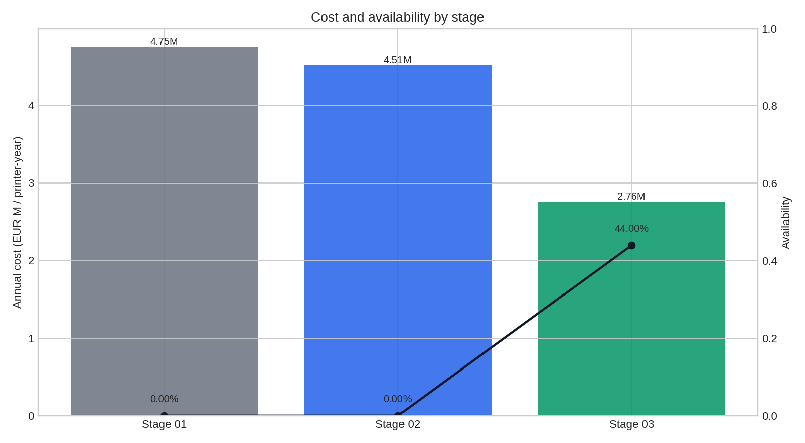
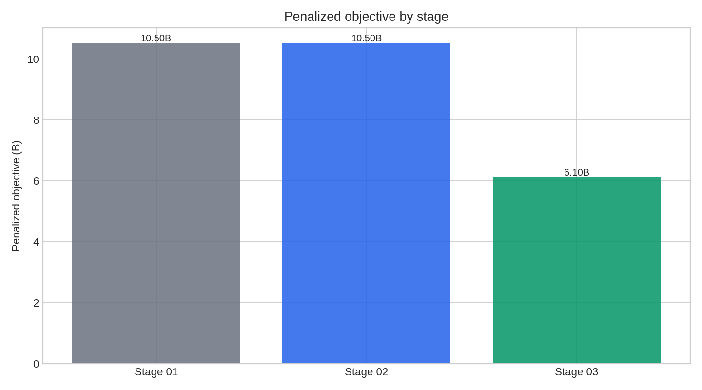
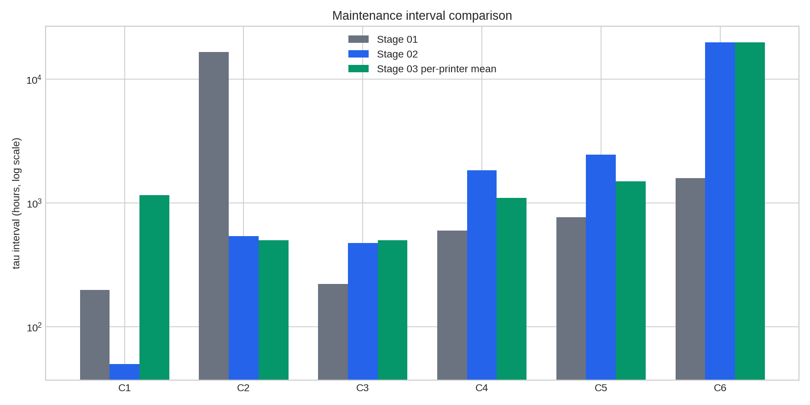
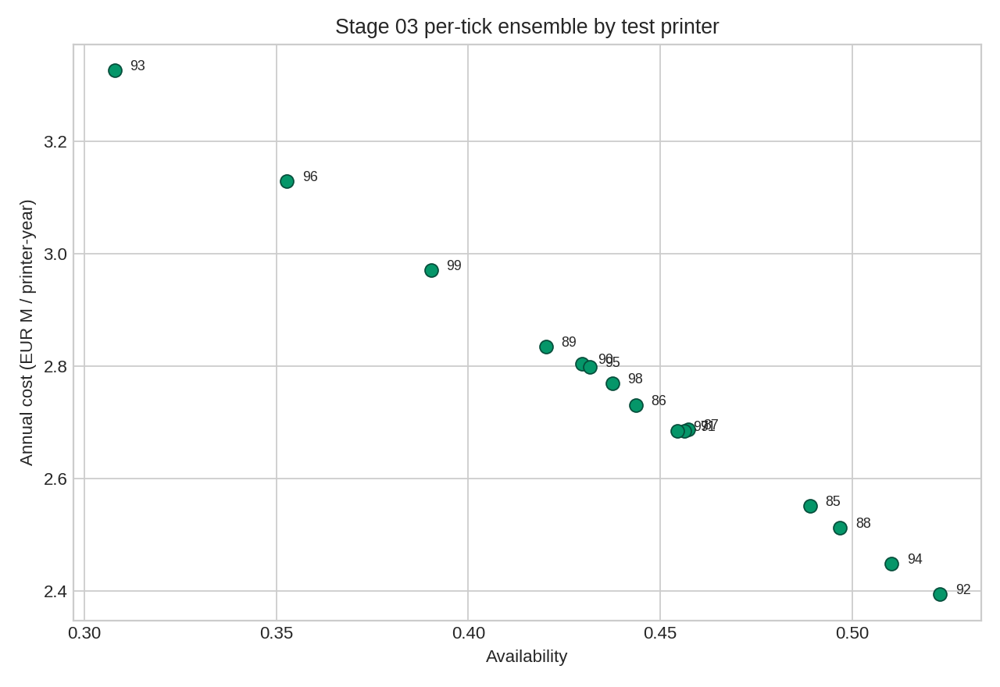

# Stage 01/02/03 Results Comparison

This report compares the three maintenance-policy stages using the generated artifacts under `ml_models/`.

Main Stage 03 result: the per-tick PPO+SPR ensemble from `ml_models/03_rl+ssl/results/per_tick/`. The earlier Stage 03 per-printer tau policy is retained below as auxiliary context because it is useful diagnostically but is weaker than the per-tick policy.

## Headline

- Best overall row by penalized objective: **Stage 03 - per-tick PPO+SPR ensemble**.
- Stage 03 per-tick reduces annual cost by **41.98%** versus Stage 01.
- Stage 03 per-tick improves availability by **44.00%** versus Stage 01.
- None of the stages reach the 95% availability constraint yet, so every final objective still includes a deficit penalty.

## Normalized KPI Table

| stage                                | policy        | annual_cost   | availability | deficit | penalized_value | cost_reduction_vs_01 | value_reduction_vs_01 |
| ------------------------------------ | ------------- | ------------- | ------------ | ------- | --------------- | -------------------- | --------------------- |
| Stage 01 - Optuna constant tau       | constant τ    | EUR 4,748,686 | 0.00%        | 95.00%  | 10.500B         | 0.00%                | 0.00%                 |
| Stage 02 - SSL/RUL surrogate tau     | constant τ    | EUR 4,507,038 | 0.00%        | 95.00%  | 10.500B         | 5.09%                | 0.00%                 |
| Stage 03 - per-tick PPO+SPR ensemble | per-printer τ | EUR 2,755,088 | 44.00%       | 51.00%  | 6.100B          | 41.98%               | 41.91%                |

## Maintenance Interval Comparison

Stage 01 and Stage 02 output one constant tau vector. The auxiliary Stage 03 per-printer tau policy outputs one tau vector per test printer; this table shows its mean/min/max by component. The main Stage 03 per-tick policy is event/action based, so it is not directly represented by a fixed tau vector.

| component | stage_01_tau_h | stage_02_tau_h | stage_03_per_printer_tau_mean_h | stage_03_per_printer_tau_min_h | stage_03_per_printer_tau_max_h |
| --------- | -------------- | -------------- | ------------------------------- | ------------------------------ | ------------------------------ |
| C1        | 199.1          | 50.0           | 1,161.7                         | 1,146.5                        | 1,196.0                        |
| C2        | 16,675.2       | 540.6          | 500.0                           | 500.0                          | 500.0                          |
| C3        | 221.6          | 473.9          | 500.0                           | 500.0                          | 500.0                          |
| C4        | 601.0          | 1,836.2        | 1,103.5                         | 1,097.3                        | 1,107.1                        |
| C5        | 770.6          | 2,462.5        | 1,501.0                         | 1,488.3                        | 1,505.6                        |
| C6        | 1,595.7        | 19,920.9       | 20,000.0                        | 20,000.0                       | 20,000.0                       |

## Stage 02 RUL Head Metrics

Mean held-out RUL error by variant:

| variant           | mae_mean_days | rmse_mean_days |
| ----------------- | ------------- | -------------- |
| scratch_all       | 8.09          | 9.29           |
| pretrained_all    | 7.10          | 8.36           |
| pretrained_frozen | 22.53         | 25.37          |

## Stage 03 Auxiliary Context

Earlier Stage 03 per-printer tau comparison from `ml_models/03_rl+ssl/results/kpi_comparison.csv`:

| stage    | policy_class  | fleet_annual_cost | fleet_availability | fleet_deficit | fleet_value |
| -------- | ------------- | ----------------- | ------------------ | ------------- | ----------- |
| stage_01 | constant τ    | EUR 4,748,686     | 0.00%              | 95.00%        | 10.500B     |
| stage_02 | constant τ    | EUR 4,507,038     | 0.00%              | 95.00%        | 10.500B     |
| stage_03 | per-printer τ | EUR 4,492,502     | 0.00%              | 95.00%        | 10.500B     |

Per-tick PPO+SPR ensemble summary from `per_tick_summary.yaml`:

| metric | value |
| --- | --- |
| fleet annual cost | EUR 2,755,088 |
| fleet availability | 44.00% |
| fleet deficit | 51.00% |
| ensemble size | 3 |
| total timesteps per seed | 20000 |

Per-printer spread for the Stage 03 per-tick ensemble:

| metric            | value         |
| ----------------- | ------------- |
| annual_cost_min   | EUR 2,394,097 |
| annual_cost_mean  | EUR 2,755,088 |
| annual_cost_max   | EUR 3,326,420 |
| availability_min  | 30.79%        |
| availability_mean | 44.00%        |
| availability_max  | 52.28%        |

## Figures









## Interpretation

Stage 02 improves cost relative to Stage 01 but leaves availability at zero in the test KPI table. Its RUL model still matters because it produces the trained encoder and RUL head used downstream, but the constant-tau surrogate winner does not satisfy the operational constraint.

The earlier Stage 03 per-printer tau policy barely improves the constant-tau policies. The per-tick PPO+SPR ensemble is materially better: it lowers annual cost and raises availability to about 44%. It is still infeasible against the 95% availability requirement, which means the next useful work is not presentation polish; it is reward/action design and simulator-policy alignment.

High-leverage next steps:

1. Increase Stage 03 training budget and evaluate more seeds.
2. Revisit the reward: availability deficit should dominate earlier, not only after annual cost has already improved.
3. Let the per-tick policy maintain C2/C4/C5/C6 more intelligently; the current ensemble fires daily preventive maintenance for C1/C3 in the per-printer event table.
4. Clear GPU/RAM contention before training. The last run had an unrelated `llama-server` occupying about 20GB on GPU 1 and the system was already using swap.

## Reproduce

```bash
uv run jupyter nbconvert --to notebook --execute --inplace ml_models/04/results/compare_01_02_03.ipynb
```
